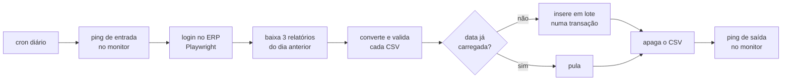

# Coletor de Relatórios

**RPA em Python que extrai do ERP os relatórios diários de descontos e cancelamentos feitos
nos caixas de uma rede de varejo e os carrega, tipados e sem duplicidade, num banco
PostgreSQL de análise.**

`Python 3.14` · `Playwright` · `PostgreSQL` · `peewee` · `requests`

---

## O problema

Os descontos concedidos e os cancelamentos de cupons e itens em todos os PDVs da rede ficam
dentro do ERP de frente de caixa (Zanthus) e só saem de lá em relatórios CSV, emitidos um a um
pela interface web. Não existe API.

Para analisar esses dados (quem deu desconto, em qual loja, por qual motivo, quanto foi
cancelado), alguém precisava entrar todo dia no sistema, emitir três relatórios, baixar os
arquivos e consolidar tudo à mão.

## O que o projeto faz

Uma execução por dia, sem intervenção humana:

1. **Avisa o monitor** de jobs que a execução começou.
2. **Entra no ERP** com um navegador automatizado e baixa os três relatórios do dia anterior,
   para todas as lojas.
3. **Converte** cada CSV para tipos de verdade (datas, valores monetários, inteiros) e confere
   se o formato do relatório não mudou.
4. **Carrega** no PostgreSQL, em três tabelas, sem nunca duplicar um dia já carregado.
5. **Apaga** os arquivos cujos dados já estão no banco.
6. **Avisa o monitor** que terminou. Se algo falhou, esse aviso não vai, e a ausência dele é o
   alarme.

Um dia típico gera cerca de 4.300 linhas de descontos, 140 de cupons cancelados e 230 de itens
cancelados.

## Fluxo



| Relatório no ERP | Tabela |
|---|---|
| Z000 — Detalhamento de descontos concedidos | `raw_descontos` |
| Z002 — Cancelamentos de cupons | `raw_cancelamentos_cupons` |
| Z003 — Cancelamentos de itens | `raw_cancelamento_itens` |

As tabelas têm o prefixo `raw_` porque são a camada de entrada: guardam o relatório como ele
veio, só que tipado. Agregações e análises ficam para quem consome.

## Estrutura

```
main.py                   orquestra a execução e trata os erros de cada etapa
coletor_relatorios/
├── automation.py         navegador: login no ERP e download dos relatórios
├── repository.py         leitura dos CSVs, conversão pt-BR e carga no banco
├── models.py             modelos das três tabelas e a conexão com o PostgreSQL
└── palantir.py           pings de entrada e saída no monitor de jobs
```

Cada arquivo tem uma responsabilidade. O navegador não sabe que existe banco, o banco não sabe
que existe navegador, e o `main.py` é o único lugar que conhece a sequência toda.

## Decisões técnicas

### Carga idempotente por data
Antes de inserir, o sistema pergunta ao banco quais datas do arquivo já existem, e só insere as
que faltam. Rodar duas vezes no mesmo dia não duplica nada. A checagem e o `INSERT` acontecem
**na mesma transação**: separados, duas execuções simultâneas passariam as duas pela checagem e
duplicariam o dia.

Não foi usada uma restrição `UNIQUE` porque os relatórios têm linhas legitimamente repetidas
(o mesmo produto com o mesmo desconto no mesmo cupom), e ela rejeitaria dado válido.

### Sempre o dia anterior (D-1)
Baixar o dia corrente traz um dia pela metade. Como a carga é por data, esse dia parcial
bloquearia o resto dele para sempre. Buscar o dia anterior garante que cada data entra
completa, uma única vez.

### Uma fonte de verdade para o formato das colunas
Cada coluna é declarada uma única vez, no modelo do banco. O resto é derivado:

- o **conversor** de cada coluna sai do **tipo do campo** (inteiro, decimal, data, texto);
- a coluna do CSV é ligada ao campo **pelo nome do cabeçalho**, não pela posição;
- as tabelas e os índices são criados a partir dos próprios modelos.

Se o ERP reordenar colunas, a carga continua correta. Se renomear ou remover alguma, a carga
daquele relatório para com uma mensagem que diz exatamente o que faltou e o que sobrou.

### Conversão do formato brasileiro
O ERP exporta em `cp1252`, com `;` como separador, datas `dd-mm-aaaa` e números no padrão
brasileiro. Até os códigos vêm formatados: `447.681` é o documento 447681, não o decimal
447,681. Uma única regra (tirar o ponto de milhar e trocar a vírgula por ponto) resolve valores
e códigos. Dinheiro usa `Decimal`, nunca `float`.

### Dependências injetadas
Nada abre conexão, lê variável de ambiente ou cria cliente no momento do import. O banco, a
pasta de trabalho e as credenciais são criados no `main.py` e passados para quem precisa. Isso
permite testar cada peça isoladamente, apontando para outro banco ou outra pasta.

## Tratamento de erros

Cada relatório é tratado de forma independente: um problema num deles não impede os outros.

| Situação | Comportamento | Resultado da execução |
|---|---|---|
| Relatório vazio | aviso no log; o CSV fica para conferência | sucesso |
| Dia já carregado | pula, sem inserir nada; o CSV é apagado | sucesso |
| Formato do relatório mudou | erro com as colunas que faltam e as que sobram | falha |
| Valor inválido | erro com arquivo, linha, campo e o valor recusado | falha |
| Download de um relatório falhou | os outros seguem | falha |
| Login ou banco fora do ar | interrompe tudo | falha |
| Monitor fora do ar | aviso no log; **não** derruba a carga | não afeta |

Em caso de falha o programa sai com código 1, para o agendador registrar o erro, e não envia o
ping de saída.

## Monitoramento

O monitor de jobs (Palantir) funciona como sinal de vida: recebe um ping na entrada e outro na
saída. Se a saída não chega, o job é marcado como falho. Por isso não existe "ping de erro":
a ausência do ping de saída já é o alarme, e isso também cobre casos em que o processo morre
sem chegar a tratar a exceção.

## Um bug que valeu a pena documentar

Na primeira versão, o filtro de data do relatório era preenchido e confirmado com **Enter**.
Funcionava porque a data era sempre a de hoje. Quando o projeto passou a buscar o dia anterior,
os relatórios continuaram vindo com a data de hoje.

A investigação mostrou que o campo tem um calendário acoplado: ao receber o Enter, ele troca a
data digitada pelo dia destacado, que é o dia corrente. O filtro **nunca tinha funcionado**, e
o erro ficava invisível porque o valor digitado e o valor imposto coincidiam. A correção foi
trocar o Enter por **Tab**, validada baixando os três relatórios de uma data passada e
conferindo a data dentro de cada CSV antes de tocar no banco.

## Como rodar

**Requisitos:** Python 3.10+, acesso ao ERP e a um PostgreSQL.

```bash
pip install -r requeriments.txt
playwright install chromium
```

Crie um `.env` na raiz:

```
URL_ZANTHUS=         # endereço do ERP
ZANTHUS_LOGIN=
ZANTHUS_SENHA=

ROBTOM_PG_HOST=
ROBTOM_PG_PORT=
ROBTOM_PG_DB=
ROBTOM_PG_USER=
ROBTOM_PG_PASSWORD=

PALANTIR_URL=         # endereço do monitor de jobs
```

Execute:

```bash
python main.py
```

Para agendar (por exemplo, todo dia às 06:00):

```
0 6 * * * cd /caminho/do/projeto && python main.py >> /var/log/coletor-relatorios.log 2>&1
```

Em servidor sem interface gráfica, altere `NAVEGADOR_SEM_JANELA = True` em `coletor_relatorios/automation.py`.

## Próximos passos

- Testes automatizados para a conversão e a carga. A validação atual foi feita executando
  contra dados reais e cenários de erro montados à mão.
- Container Docker para padronizar a execução no servidor.
- Nova tentativa automática quando o download de um relatório falhar.
